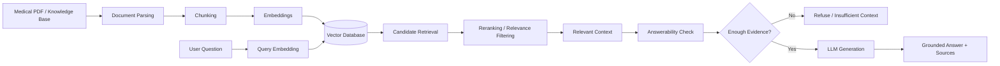

# Research-Paper-RAG-Assistant-AI-Hackathon
```markdown
# 🧠 Clinical Epilepsy RAG System

A Retrieval-Augmented Generation (RAG) system designed to answer clinical and scientific questions using an epilepsy-focused knowledge base while reducing hallucinations and refusing unsupported questions.

The project provides **two deployment options**:

- 🖥️ **Local Version** — runs the LLM locally using Ollama.
- ☁️ **API Version** — uses cloud-based APIs for embeddings and LLM inference.

Both versions follow the same core RAG philosophy:

> **Retrieve relevant evidence first, then generate an answer grounded only in that evidence.**

---

# 🚀 Project Overview

This project was developed during the **AI Clinical Decision Support Lite Hackathon**.

The main goal was to build a clinical RAG system capable of:

- Retrieving relevant medical evidence
- Generating grounded answers
- Reducing hallucinations
- Refusing unsupported questions
- Providing source/page information
- Evaluating retrieval and answer quality

The system evolved through multiple iterations, from a basic RAG pipeline to a more advanced retrieval and safety architecture.

---

# 🏗️ RAG Architecture



---

# 🔀 Two Execution Modes

The project supports two different ways to run the RAG system.

## 🖥️ 1. Local Version

The Local Version is designed to run the LLM directly on the user's machine.

### Local LLM

We use:

```
Ollama
└── llama3.2:latest
```

The advantage is that the LLM inference can run locally without sending the final question and context to a third-party LLM API.

### Typical Local Pipeline

```
PDF
 ↓
Parsing
 ↓
Chunking
 ↓
Embeddings
 ↓
Vector Database
 ↓
Semantic Retrieval
 ↓
Relevant Context
 ↓
Ollama
 ↓
Llama 3.2
 ↓
Grounded Answer
```

### Requirements

- Python 3.10+
- Ollama
- Llama 3.2 model
- Required Python packages

Make sure Ollama is installed and the model is available:

```bash
ollama list
```

If needed:

```bash
ollama pull llama3.2
```

Then verify:

```bash
ollama run llama3.2
```

---

# ☁️ 2. API Version

The API Version uses cloud-based services for model inference and embeddings.

The API implementation uses:

- Hugging Face API for embeddings
- Groq API for LLM inference
- Local Qdrant for vector storage
- FastAPI for exposing the RAG system as a REST API

The API architecture is:

```
Knowledge Base
 ↓
Chunking
 ↓
Embedding API
 ↓
Qdrant
 ↓
Query Embedding
 ↓
Vector Search
 ↓
Retrieved Context
 ↓
Groq LLM
 ↓
Grounded Answer
 ↓
FastAPI
```

---

# 🧩 Key Components

| Component | Local Version | API Version |
| --- | --- | --- |
| LLM | Ollama / Llama 3.2 | Groq API |
| Embeddings | Local embedding model | Hugging Face API |
| Vector Database | Local vector database | Local Qdrant |
| Retrieval | Semantic Search | Qdrant Vector Search |
| Generation | Local LLM | Cloud LLM |
| API Layer | Optional | FastAPI |
| Evaluation | Supported | Supported |

---

# 🔎 Retrieval Pipeline

The system does not directly send the entire document to the LLM.

Instead, the question is first converted into an embedding.

```
User Question
      ↓
Question Embedding
      ↓
Vector Search
      ↓
Top-K Candidate Chunks
      ↓
Relevance Filtering / Reranking
      ↓
Final Context
```

This reduces unnecessary context and allows the LLM to focus on the most relevant evidence.

---

# 🧠 Advanced Retrieval

The later version of the system introduced several retrieval improvements.

### 1. Sentence-Aware Chunking

Instead of blindly splitting text, the system attempts to preserve meaningful sentence boundaries.

This helps prevent important medical statements from being split across unrelated chunks.

### 2. BGE Embeddings

BGE embeddings are used to represent the semantic meaning of the document chunks and user queries.

### 3. Cross-Encoder Reranking

The system can initially retrieve multiple candidate chunks and then use a reranker to select the most relevant evidence.

Example:

```
Initial Retrieval
      ↓
Top 12 candidates
      ↓
Cross-Encoder Reranker
      ↓
Top 4 relevant chunks
```

### 4. Lexical Relevance

In addition to semantic similarity, lexical overlap can be used as another relevance signal.

This helps when important medical terms appear explicitly in both the question and the retrieved evidence.

### 5. Combined Scoring

The final retrieval score can combine multiple signals:

```
75% → Reranker Score
15% → Semantic Similarity
10% → Lexical Score
```

This provides a more robust relevance signal than relying on a single similarity metric.

---

# 🛡️ Answerability & Hallucination Control

One of the main goals of this project is to avoid unsupported answers.

The system therefore separates:

```
Retrieval
    ↓
Answerability Check
    ↓
Generation
```

Before generating an answer, the system checks whether the retrieved evidence actually contains enough information to answer the question.

If sufficient evidence is not available, the system should refuse instead of guessing.

Example:

```
Question:
What is the chemical formula of water?

Result:

"I couldn't find an answer to this question in the PDF."
```

This is intentional behavior.

> **A careful refusal is better than a confident hallucination.**
> 

---

# 🔢 Numeric Question Handling

Clinical documents contain many numerical facts such as:

- Percentages
- Rates
- Incidence
- Prevalence
- Dosages
- "per 1000"
- "per 100,000"
- Patient counts

The system therefore includes additional handling for numerical questions.

The pipeline can:

```
Detect Numeric Question
        ↓
Retrieve Evidence
        ↓
Verify Numerical Evidence
        ↓
Generate Answer
        ↓
Check / Repair Numeric Content
```

This helps reduce errors where the model retrieves the correct evidence but changes, omits, or reformats an important number.

---

# 🤖 Grounded Generation

The LLM is instructed to use the retrieved context as the source of truth.

The generation prompt follows principles such as:

- Use only retrieved evidence
- Do not use external knowledge
- Do not guess
- Do not invent unsupported facts
- Answer only what was asked
- Refuse when the evidence is insufficient
- Preserve important numerical information
- Provide source information when available

---

# 📚 Sources & Citations

The system keeps metadata associated with retrieved chunks, including information such as:

- Source ID
- PDF page
- Similarity score
- Retrieved text

This makes it possible to inspect where an answer came from.

Example:

```
Source 1
PDF Page: 23
Similarity: 0.81
```

---

# 📊 Evaluation

Evaluation was treated as an important part of the system rather than simply checking whether the chatbot "looks correct."

The evaluation process considered areas such as:

- Retrieval Precision@K
- Hit@K
- Mean Reciprocal Rank (MRR)
- Similarity scores
- Answer relevance
- Faithfulness
- Citation accuracy
- Out-of-domain refusal
- Unsupported claims

The API implementation also includes an automated evaluation pipeline with retrieval metrics and LLM-as-a-judge evaluation.

---

# 🗂️ Project Structure

A simplified project structure is:

```
Clinical-Epilepsy-RAG/
│
├── local/
│   ├── rag.py
│   ├── ...
│   └── README / configuration
│
├── api/
│   ├── main.py
│   ├── retrieval.py
│   ├── rag_chat.py
│   ├── vector_store.py
│   ├── api.py
│   ├── evaluation.py
│   └── ...
│
├── knowledge_base/
│   └── epilepsy_parsed.md
│
├── requirements.txt
│
└── README.md
```

> The exact filenames may vary depending on the selected implementation.
> 

---

# ⚙️ Local Version — Getting Started

## 1. Install dependencies

```bash
pip install -r requirements.txt
```

## 2. Make sure Ollama is running

Check installed models:

```bash
ollama list
```

Make sure:

```
llama3.2:latest
```

is available.

## 3. Run the Local RAG

```bash
python rag.py
```

Then ask questions directly from the terminal.

Example:

```
Your question: How does the ILAE define epilepsy?
```

---

# ☁️ API Version — Getting Started

## 1. Create a virtual environment

Windows:

```powershell
python -m venv .venv
```

Activate it:

```powershell
.venv\Scripts\Activate.ps1
```

Linux / macOS:

```bash
python -m venv .venv
source .venv/bin/activate
```

## 2. Configure environment variables

Create a `.env` file:

```
HF_TOKEN=your_hugging_face_token
GROQ_API_KEY=your_groq_api_key
```

Never commit your real API keys to GitHub.

## 3. Generate document embeddings

```bash
python main.py
```

## 4. Build the local Qdrant vector store

```bash
python vector_store.py
```

## 5. Test retrieval

```bash
python retrieval.py "What are the main causes of epilepsy?" --limit 4
```

## 6. Run the RAG CLI

```bash
python rag_chat.py
```

Or ask one question:

```bash
python rag_chat.py "How is drug-resistant epilepsy managed?"
```

## 7. Start the FastAPI server

```bash
uvicorn api:app --reload --port 8000
```

API endpoints:

```
GET  /health
POST /ask
```

Interactive API documentation:

```
http://localhost:8000/docs
```

---

# 🌐 Optional Streamlit Interface

If the Streamlit interface is included:

```bash
streamlit run streamlit_app.py
```

Then open:

```
http://localhost:8501
```

The interface can provide:

- Interactive chat
- Retrieved source inspection
- Similarity information
- Quick prompts

---

# 🧪 Running Evaluation

For the API implementation:

```bash
python evaluation.py
```

The evaluation pipeline can measure:

- Retrieval quality
- Citation validity
- Faithfulness
- Answer relevance
- Out-of-domain refusal

---

# 🔐 Security

Do not commit secrets to GitHub.

Never upload:

```
.env
API keys
HF tokens
Groq keys
private credentials
```

Use environment variables instead.

Example:

```
GROQ_API_KEY=your_key_here
HF_TOKEN=your_token_here
```

---

# 🧠 What I Learned

This project was built as a hands-on learning experience.

The main concepts explored include:

- Retrieval-Augmented Generation
- Document parsing
- Chunking strategies
- Embeddings
- Semantic search
- Vector databases
- Reranking
- Prompt engineering
- Grounded generation
- Hallucination reduction
- Answerability detection
- Citation grounding
- Numeric answer validation
- Retrieval evaluation
- LLM evaluation
- Local LLM inference
- API-based LLM inference

---

# 🚀 Future Improvements

Potential future improvements include:

- Hybrid retrieval
- Better query expansion
- Improved reranking
- More robust answerability detection
- Larger evaluation datasets
- More clinical knowledge sources
- Better citation formatting
- Improved numerical verification
- User-facing web interface
- More comprehensive safety evaluation

---

# 👥 Team

Developed as part of the AI Clinical Decision Support Lite Hackathon.

### Team Members

- Abdelrahman Gad
- Mahmoud Osman
- Ahmed Abourehab
- Mohammed Allam

---

# 🙏 Acknowledgments

Special thanks to everyone who contributed to organizing and supporting the hackathon and provided the learning environment that made this project possible.

---

# 📄 Project Resources

- **Presentation:** `https://docs.google.com/presentation/d/1bmKh-OUFwy9qbfiksPBOokhFg4rdmdy9/edit?usp=drivesdk&ouid=115126713159904685119&rtpof=true&sd=true`
- **GitHub Repository:** `https://github.com/mohammedwetwet/Research-Paper-RAG-Assistant-AI-Hackathon`

---

# ⚠️ Disclaimer

This project is an educational and research prototype.

It is **not a medical device** and should not be used to make real-world clinical decisions or replace professional medical advice.
